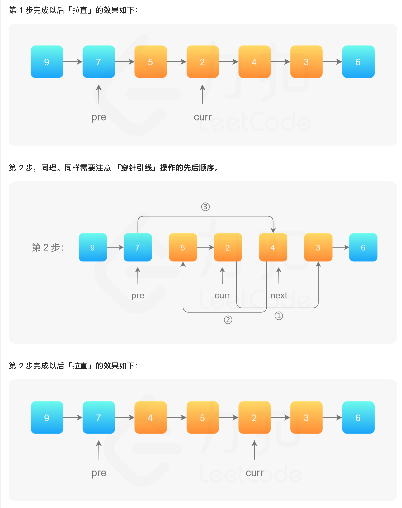

# 数据结构——链表相关操作
明确链表节点定义
```cpp
struct ListNode {
    int val;
    ListNode* next;
    ListNode(int x = 0) : val(x), next(nullptr) {}
};
```

1. 链表反转（整个链表）
```cpp
ListNode* reverseList(ListNode* head) {
    ListNode* pre = nullptr;
    ListNode* cur = head;

    while (cur) {
        ListNode* nxt = cur->next;
        cur->next = pre;
        pre = cur;
        cur = nxt;
    }
    return pre;
}
```
2. 链表反转（区间）
```cpp
ListNode* reverseBetween(ListNode*head,int L,int R){
    ListNode*dum=new ListNode();
    ListNode*pre=&dum;
    for(int i=0;i<L-1;i++)//找到要翻转的区间的前一个节点
    {
        pre=pre->next;
    }
    ListNode*curr=pre->next;//curr指向要翻转的区间的第一个节点
    for(int i=0;i<R-L;i++)//重复R-L次
    {
        //穿针引线法
        ListNode*nxt=curr->next;
        curr->next=nxt->next;
        nxt->next=pre->next;
        pre->next=nxt;
    }
}
```

3. 判断链表是否有环，若有返回环入口的指针
```cpp
ListNode* HasCycle(ListNode*head)
{
    ListNode*slow=head;
    ListNode*fast=head;
    while(fast&&fast->next)
    {
        slow=slow->next;
        fast=fast->next->next;
        if(slow==fast)
        {
            ListNode*begin=head;
            while(begin!=slow)
            {
                slow=slow->next;
                begin=begin->next;
            }
            return slow;

        }
    }
    return nullptr;
}
```
4. 合并两个有序链表
```cpp
ListNode* mergeTwoLists(ListNode* l1, ListNode* l2) {
    ListNode* dummy=new ListNode();
    ListNode* tail = dummy;

    while (l1 && l2) {
        if (l1->val < l2->val) {
            tail->next = l1;
            l1 = l1->next;
        } else {
            tail->next = l2;
            l2 = l2->next;
        }
        tail = tail->next;
    }
    tail->next = l1 ? l1 : l2;
    return dummy->next;
}

```
5. 对链表归并排序
> 需要注意的是归并排序中传入的链表是不带头节点的链表
```cpp
ListNode*findMid(ListNode*head)
{
    if(head==nullptr||head->next==nullptr)
    {
        return head;
    }
    ListNode*slow=head;
    ListNode*fast=head;
    ListNode*prev=nullptr;
    while(fast&&fast->next)//涉及快慢指针时常用的边界判定方法
    {
        prev=slow;
        slow=slow->next;
        fast=fast->next->next;
    }
    prev->next=nullptr;
    /*
    此处为了使前后链表断开，为后续归并做准备
    比如1->2->3->4->5
    变为1->2->3 和 4->5
    */
    return slow;
}

ListNode* mergeTwoLists(ListNode* l1, ListNode* l2) {
    ListNode* dummy=new ListNode();
    ListNode* tail = dummy;

    while (l1 && l2) {
        if (l1->val < l2->val) {
            tail->next = l1;
            l1 = l1->next;
        } else {
            tail->next = l2;
            l2 = l2->next;
        }
        tail = tail->next;
    }
    tail->next = l1 ? l1 : l2;
    return dummy->next;
}

ListNode* mergeSort(ListNode*head)//传入的是不带头节点的链表
{
    if(head==nullptr||head->next==nullptr)
    {
        return nullptr;
    }
    ListNode*mid=findMid(head);

    ListNode*left=mergeSort(head);
    ListNode*right=mergeSort(mid);
    
    List*ans=mergeTwoLists(left,right);
    return ans;
}

```
6. 


