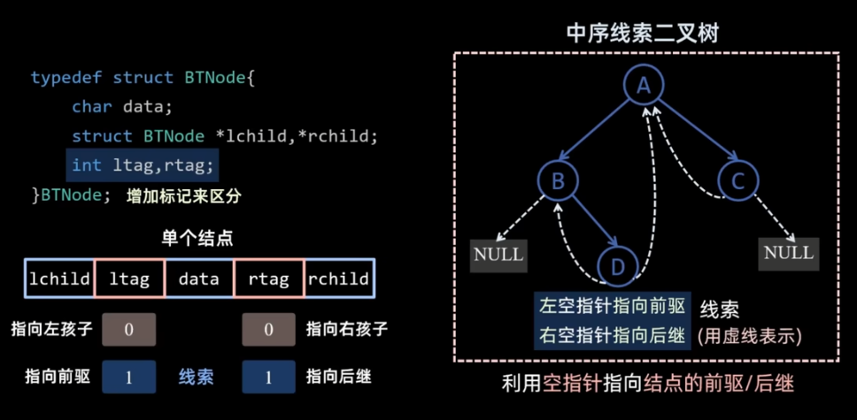

# 树相关操作
## 1 树的结点定义
```cpp
struct TreeNode{
    int val;
    TreeNode*left;
    TreeNode*right;
    TreeNode(int x):val(x),left(nullptr),right(nullptr){}
}
```

## 2 树的遍历
### 2.1 三种遍历方式

```cpp
void traversal(TreeNode*root)
{
    if(root!=nullptr)
    {
        //visit(root)前序操作
        traversal(root->left);
        //visit(root)中序操作
        traversal(root->right);
        //visit(root)后序操作
    }
}
```

### 2.2 根据前+中序、后+中序构建二叉树

```cpp
//前+中序
TreeNode*build(
    vector<int>&preorder,int preL,int preR,
    vector<int>&inorder,int inL,int inR,
    unordered_map<int,int>&pos
)
{
    if(preL>preR)return nullptr//递归返回条件

    //确定根结点    
    int rootVal=preorder[preL];
    TreeNode*root=new TreeNode(rootVal);

    int k=pos[rootVal];//这里k就是中序序列中根所在的位置的下标
    int leftSize=k-inL;

    //这里可借助草稿确定新的边界范围
    root->left=build(
        preorder,preL+1,preL+leftSize,
        inorder,inL,k-1,
        pos
    );

    root->right=build(
        preorder,preL+leftSize+1,preR,
        inorder,k+1,inR,
        pos
    );

    return root;
}
```

```cpp
//后+中序
TreeNode*build(
    vector<int>&postorder,int postL,int postR,
    vector<int>&inorder,int inL,int inR,
    unordered_map<int,int>&pos
)
{
    if(postL>postR)return nullptr;//递归返回条件

    //确定根结点    
    int rootVal=postorder[postR];
    TreeNode*root=new TreeNode(rootVal);

    int k=pos[rootVal];//这里k就是中序序列中根所在的位置的下标
    int rightSize=inR-k;

    //这里可借助草稿确定新的边界范围
    root->left=build(
        postorder,postL,postR-rightSize-1,
        inorder,inL,k-1,
        pos
    );

    root->right=build(
        postorder,postR-rightSize,postR-1,
        inorder,k+1,inR,
        pos
    );

    return root;
}
```

> 而上述代码中涉及到哈希表pos的构建，因此整个二叉树的构建可以用下面的adapter函数来实现


```cpp
TreeNode*buildTree(
    vector<int>&preorder,
    vector<int>&inorder
)
{
    unordered_map<int,int>pos;
    for(int i=0;i<inorder.size();i++)
    {       
        pos[inorder[i]]=i;
    }
    return build(
        preorder,0,preorder.size()-1,
        inorder,0,inorder.size()-1,
        pos
    );
}

```

### 2.3 计算树的高度


```cpp
int height(TreeNode*root)
{
    if(root==nullptr)
    {
        return 0;
    }
    return max(height(root->left),height(root->right))+1;
}
```

### 2.4 平衡二叉树构建


### 2.5 线索二叉树



- 前序线索二叉树方便找后继，**无法有效查找先序前驱**
- 后序线索二叉树方便找前驱，**无法有效查找后序后继**
- 因为后序线索二叉树遍历为不断找后继的过程，因此其遍历仍需要栈的支持


### 2.6 WPL计算

```cpp
void WPL(TreeNode*root,int layer,int &sum)
{
    if(root==nullptr)
    {
        return;
    }

    if(root->left==nullptr&&root->right==nullptr)
    {
        sum+=(root->val)*layer;
    }
    WPL(root->left,layer+1,sum);
    WPL(root->right,layer+1,sum);

}
```

递归中：

- **路径状态（path / layer / 当前和） → 一般不用 &，用值传递**
- **全局累计量（答案 / 计数 / 最优值） → 用 & 或全局变量**
