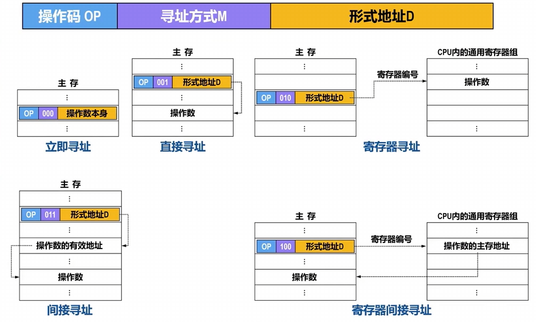
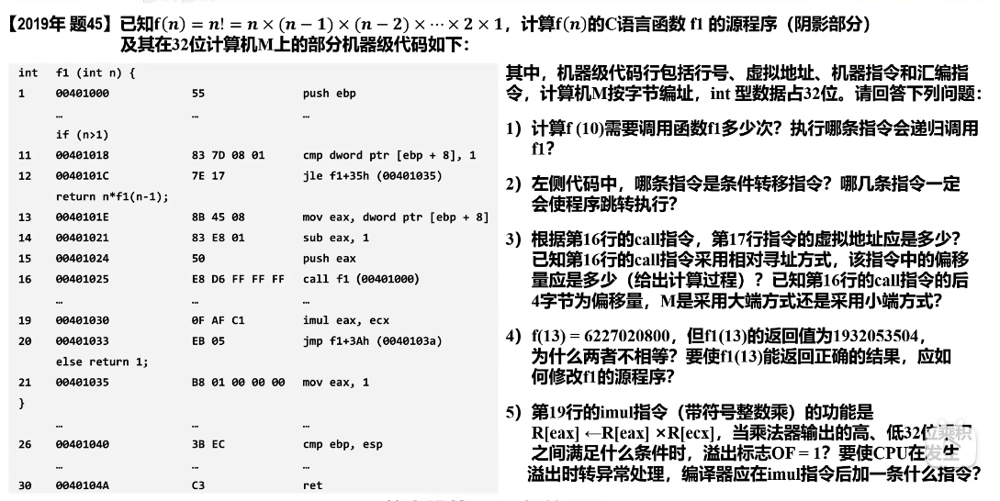
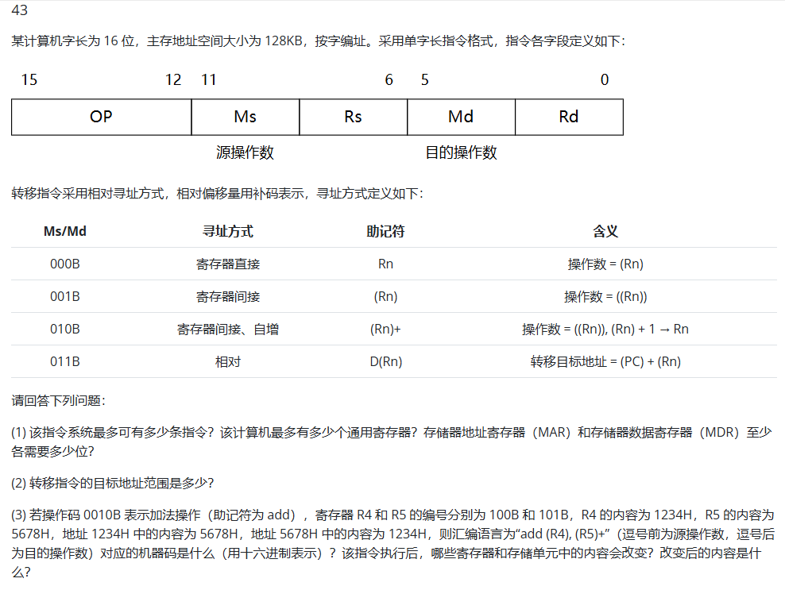
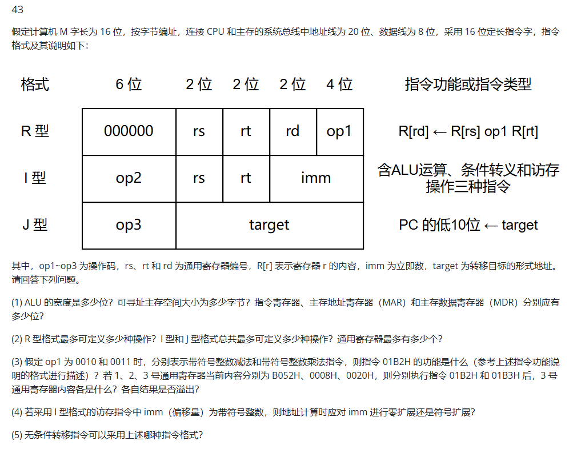

# 指令系统相关笔记
## 一些知识点

### 1. 寻址方式

区分指令寻址和操作数寻址，我们大多数说的寻址都是指后者，前者主要有顺序寻址和跳跃寻址两种，比较简单便不再赘述

操作数寻址的过程就是把寻址方式M和形式地址D的不同组合转换为有效地址的过程

- **立即寻址：** 访问0次主存，操作数在指令中一起
- **直接寻址：** 访问1次主存，操作数在主存中，D给出操作数所在主存地址
- **寄存器寻址：** 访问0次主存，操作数在寄存器中，D给出操作数所在寄存器的编号
- **间接寻址：** 访问2次主存，操作数在主存中，D给出间接地址，间接地址所指向的主存单元中的内容才是操作数的有效地址
- **寄存器间接寻址：** 访问1次主存，操作数在主存中，D给出一个寄存器编号，这个寄存器里放的是操作数所在主存单元的地址

以下寻址方式则均是由某个寄存器的内容+偏移量得到操作数的有效地址，因此统称为**偏移寻址**(**均访存一次**)

- **相对寻址：** 操作数在主存中，D为相对当前PC值(**注意这里的PC已经指向下一条指令**)的偏移量，用于形成操作数的主存地址：EA=(PC)+A，偏移量为补码表示
- **变址寻址：** 操作数在主存中，指令中原来的形式地址段被分为变址寄存器编号n和形式地址D，形式地址D在指令执行过程中保持不变，变址寄存器n的内容可变，操作数的地址由变址寄存器的值+形式地址得到，多用于数组元素的访问：EA=(IX)+A
- **基址寻址：** 二者的指令结构完全相同，只是这里的变址寄存器变为了基址寄存器，且其内容不可变，而形式地址D的值可变，具体区别如下：

| 概念                    | 寄存器编号n | 形式地址D |
| --------------------- | -------- | ------- |
| 变址寻址             | 为变址寄存器，内容可变        | 值不可变       |
| 基址寻址     | 为基址寄存器(对用户透明)，内容不可变        | 值可变       |

此外还有一种特殊的寻址方式

- **堆栈寻址：** 对存放在堆栈中的操作数进行寻址的方法称为堆栈寻址，分为以下两种
    - 寄存器堆栈：在专用寄存器组中划分出一片区域按LIFO管理，也称**硬堆栈**
    - 存储器堆栈：在主存空间中划分出一片区域按LIFO管理，也称**软堆栈**，需要一个特定寄存器来记录堆栈中存储单元的地址，该寄存器被称为堆栈指针(SP)

当然也可以把寻址方式复合起来(**均访存两次**)：

- 相对寻址+间接寻址：EA=((PC)+A)
- 变址寻址+间接寻址：EA=((IX)+A)
- 间接寻址+变址寻址：EA=(IX)+(A)

## 小题

### 1. 下列哪些内容属于ISA规定的内容

    I.指令字格式和指令类型
    II.CPU时钟周期
    III.通用寄存器个数和位数
    IV.加法器的进位方式

> I和III是正确的(ISA可理解为软件可见部分)

### 2. 设计某指令系统时，采用16位定长指令字格式，包含0地址，1地址，2地址三种格式的指令，若2地址的指令有12条，1地址的指令有254条，则零地址指令的条数最多为

    A.0
    B.2
    C.64
    D.128

> 选D,带入下述公式即可得到答案

此题可以引出扩展指令中x地址指令条数的计算公式：

> 若指令长度位n位，每个地址占t位，有a条零地址指令，b条一地址指令，c条二地址指令，d条三地址指令

\[
    a+b\times 2^t + c\times 2^{2t} + d\times 2^{3t} \leq 2^n
\]

## 大题

### 2017

#### 1. f1的机器指令代码占多少字节?

> 应该为末尾地址-初始地址+1，$(0040107F-00401020+1)_{16}=(127-32+1)_{10}=96_{10}$ 

#### 4. shl通过左移操作实现power*2运算，在f2中能否也用shl指令实现power\*2? 为什么?

> 显然不能，理由为：
>
> f2中变量power是float型，其机器数不包含最高有效数位，但包含了阶码部分，将其作为一个整体左移时不能实现乘以2的功能

### 2019

#### 5. 满足什么条件时，OF=1，应该在imul后加一条什么指令?

> 若乘积的高33位不全为0或不全为1，则OF=1
>
> 应该在imul指令后加一条 **"溢出自陷指令"**，当OF=1时调出溢出异常处理程序

### 2023

#### 2. 采用哪种寻址方式?给出计算过程

> 采用相对寻址方式，因为发现PC+2后加上指令中的09H得到的就是目的跳转地址，09H就是这里给出的相对于PC的偏移量，第七条分析同理
>
> 目标地址=0040 1079H+2+09H=0040 1084H

#### 3. 源操作数采用什么寻址方式? ecx中存放的是什么，M采用的是大端还是小端?

> 第19条指令的源操作数为0AH，直接在机器指令0A 00 00 00给出，因此采用立即数寻址方式
>
> 此处的ecx和edx共同在二维数组中寻址，ecx其实相当于对行号寻址，这里需要注意的是**数组中每个元素占4字节**，因此ecx中存放的应为i\*64\*4=i*256
>
> 小端，直观看题可得

#### 4. 是否发生缺页异常，为什么?

> 不会
>
> 因为第19条指令所在的该程序段都在页号为00401H的同一个页面中，执行第19条指令时，该页已在主存，因此取指令过程不会发生缺页异常

### 2024 

#### 1. 为什么shamt字段占5位?

> 通用寄存器宽度为32位，于是shamt占$log_{2}32=5位$

#### 3. Ext的取值可以是1，也可以是0，为什么?

> slli指令的移位位数只使用IR[31:20]中的低5位，与高位IR[31:25]及扩展出的位无关，所以Ext取值可为0或1

### 2010

#### 1. MAR需要多少位

> 注意这里题目中为按字编址，因此可寻址范围为128KB/2B=2^16，因此MAR为16位

#### 2. 转移地址的目标地址范围是多少?

> 记住其能表示整个存储空间(**$0000H \sim FFFFH$**)
> 
> 因为其可表示的相对偏移量为$-2^{15} \sim 2^{15}-1$，而主存地址空间为$2^{16}$

#### 3. 哪些寄存器和存储单元会改变，改变后内容是什么?

> 这里不考虑PC的改变(取出指令时已递增)，因此改变的只有R5寄存器中的值和存储单元5678H中的值
>
> 分别变为5679H和68ACH

### 2021

#### 1. ALU宽度为多少?

| 错误想法                 | 正确认识 |
| -------------------- | ---- |
| 数据线 8 位 → ALU 8 位    | ❌    |
| 寄存器 16 位 → ALU ≥16 位 | ✅    |
| 总线限制运算能力             | ❌    |
| 总线限制访存带宽             | ✅    |

> 因为ALU是对寄存器中的内容进行运算的，其位数需要与寄存器宽度相等，而寄存器宽度与机器字长相等，因此为16位

#### 2. I型和J型指令总共可定义多少种操作?

> 此处注意I型和J型共享6位的操作码，而000000已经被R型占用，因此总共只能定义64-1=63种操作

