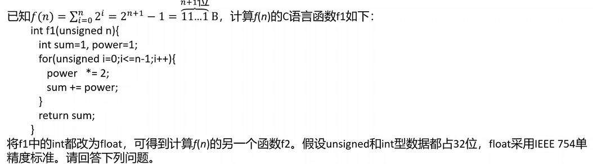

# 数制与编码相关笔记
## 一些知识点

### 1. 原码、补码、反码、移码

注意补码能多表示一个最小负数，且这个最小负数的真值不能用取反+1来判定，而是一种人为规定，比如-8的补码为1000

仅补码和移码有唯一的0(把原码和反码中那个多余的表示0的数值用来表示多的一个最小负数)

#### 1.1 双符号位补码

- 00：表示正数
- 01：表示上溢出
- 10：表示下溢出
- 11：表示负数

### 2. 浮点数与IEEE 754

#### 2.1 基本概念

首先理解阶码和尾数的概念

随后可以给出浮点数的定义公式

\[
    N=r^E \times M
\]

随后需要理解这一数轴中各个边界的含义

其中负数的各个边界其实就是正数的各个边界取反得到的(注意补码能够多表示一个最小负数)，因此了解正数的各个边界值即可

- **最大正数：** 包含最大阶码和最大尾数，前者很好理解，主要是后者：比如五位尾数(含一位符号位)的最大值为0.1111，小数点后各个位分别为$2^{-1}、2^{-2}…2^{-4}$，则其为0.9375，而这正是$1-2^{-4}$，可以这样理解，0.1111再加上0.0001就变成1.0000了，因此1减去这个0.0001就得到了最大的尾数，因此最大尾数就是$1-2^{-n}$
- **最小正数：** 对应最小阶码和最小尾数，同样侧重与最小尾数的分析：同样以五位尾数为例，最小的正数尾数为0.0001，因此其值为$2^{-4}$

#### 2.2 规格化

要求尾数的最高位是一个有效值，在基数为2的情况下，也即尾数的最高数值为1，规格化能使浮点数表示形式唯一，精度最高

规格化中的左规和右规是对于整个数的左移或右移，小数点是不动的

#### 2.3 IEEE 754

借助此数轴来理解阶码为全1和全0时对应的特殊用途(表示特殊的浮点数)

这里也可以看出规格化数的阶码的范围应为-1<=E<=254

- **阶码全0：**
    - 尾数全0，则看符号位，分为正0和负0
    - 尾数不为0，则为非规格化数(阶码真值固定为-126)
- **阶码全1：**
    - 尾数全0，则看符号位，分为正无穷和负无穷
    - 尾数不为0，说明是非数(NaN)

各个边界值的确定：

- **最大规格化正数：**

    从机器码角度理解，最大的正数应该是阶数和尾数均最大，因此机器码为0 0111 1111 1111 1111 1111 1111 1111 111
    
    阶码为1111 1110即254，把移码转为原码，对应的十进制偏移值为254-127=127，将尾数转为十进制(**注意隐含的小数点左侧的1**)1.11……1，这里可以这样理解，小数点后有23位，再加上一个$2^{23}$ 就变成10.00……0(也就是十进制的2)了，因此这时候的尾数可以表示为$2-2^{23}$ 因此目前的最大规格化正数就为$2^{127}\times (2-2^{23})=2^{128}-2^{104}=3.4\times 10^{38}$

- **最小规格化正数：**

    依旧从机器码角度理解，最小的正数阶码和尾数都应最小，因此机器码为0 0000 0001 0000 0000 0000 0000 0000 000

    这里需要注意的是阶码不能都取到0，结合上述的数轴理解，全0和全1的阶码有特殊用途，然后是尾数之所以能全取0，而不是最后一个为1，是因为隐含了小数点左侧的一个1，因此这里尾数全0不会导致它变成真值0

    阶码为0000 0001，移码转原码，得到1-127=-126，尾数很简单1.00……0，就是1，因此最小规格化正数为$2^{-126}\times 1=2^{-126}=1.17\times 10^{-38}$

- **最大非规格化正数：**

    这里就是数轴中的特殊情况之一，阶码全0，这是阶码的真值固定为-126，而且此时不隐含小数点左侧的1，因此机器码0 0000 0000 1111 1111 1111 1111 1111 111，尾数最大即可保证其最大，这里尾数为0.11……1，**注意没有隐含小数点左侧1**，因此这一尾数的真值为$1-2^{-23}$，(依旧可以这样理解，加了个$2^{-23}$ 就变成1了)，因此计算得到$2^{-126}\times (1-2^{-23})= 2^{-126}-2^{-149}=1.17\times 10^{-38}$

    值得注意的是，它和最小规格化正数并不完全相等，还有$2^{-149}$这么一个非常小的误差

- **最小非规格化正数：**

    同样按照上面理解，机器码可写为0 0000 0000 0000 0000 0000 0000 0000 001，这里需要留意的是最后一位得为1了，因为没有小数点左侧隐含的1来帮我们保证尾数全0时仍为正数，这里尾数全0就真是0了，因此最后一位得为1，才表示最小正数

    计算得到$2^{-126}\times 2^{-23}= 2^{-149}$，也就是最小的非规格化正数

至于负数的边界情况，把对应的正数的边界的符号位改为1即可

#### 2.4 浮点数的加减

浮点数可表示的**连续整数范围**与可表示的**范围**具有不同含义

阶码位数决定范围、尾数位数决定可表示的连续整数的范围

比如float型，其尾数23位，但隐含了1位，因此为24位，因此$1.f\times 2^{23}$即可将24位的整数全部正确表示，即可表示的连续整数范围大约为$-2^{24} \sim 2^{24}$

在连续整数范围内的操作不会造成舍入

具体步骤：
1. 对阶，阶数小的对齐到阶数大的，其中对尾数进行右规，每右规一次阶数+1
2. 尾数加减
3. 结果规格化
    - 左规，每左规一次阶数减1，阶码可能下溢，若出现下溢则运算结果视为0，右规仅一次，
    - 右规操作仅一次，右规对应阶数加1，阶码可能上溢，若上溢则认为结果为无穷
4. 舍入处理
    - 截断法
    - 末位恒置1法
    - 0舍1入法

### 2. 快速比较补码的大小

> 看数值位的大小即可，越大说明其真值就越大

**比较补码 1111 1101(-3) 和 1101 1100(-36) 的大小**

因为111 1101大于101 1100，所以前者大

### 3. CF、OF、ZF、SF的含义及如何确定

- CF：借位标识(适用于无符号数)
- OF：溢出标识(适用于有符号数)
- ZF：零标志(标记运算结果是否为0)
- SF：符号标志(正数为0，负数为1)

SF和ZF很好判断，而CF和OF可以从ALU硬件层的角度去判断。

> ALU是不会区分有符号数或无符号数的，它的运算对象就是机器数，从硬件角度去计算这些标识符不用区分是否为符号数，全部转为机器数来运算并判断即可

如果计算得到的机器数中最高位的进位值和次高位的进位值异或的结果为1，则说明OF=1，反之为0,即

\[
    \textrm{OF}=C_{n} \oplus C_{n-1}
\]

对于CF，则可以先按语义这样理解：Sub=0，说明为加法，最高位的进位值为1，则表示溢出，而Sub=1，说明为减法，最高位的进位值为0，则表示溢出，因此CF可表示为

\[
    \textrm{CF}=\textrm{Sub} \oplus C_{out}
\]

两个公式中的 $C_n$ 和 $C_{out}$ 其实含义相同，都是最高位的进位值

| 写法        | 含义        |
| --------- | --------- |
| $C_{out}$   | 整个加法器最终进位 |
| $C_n$     | 最高位产生的进位  |
| $C_{n-1}$ | 进入最高位的进位  |

### 4. 无、有符号数大小的比较

> 所有的大小判断都是通过判断A-B的各个标识位来确定的

#### 无符号数
- **A=B：** ZF=1，这很显然，A-B=0说明二者相等
- **A>B：** ZF=0，CF=0，前面提到CF适用于无符号数，这里的CF=0其实就是说明没有进位，显然如果A>B，A是够减的，自然CF=0
- **A<B：** ZF=0，CF=1，A不够减，因此CF=1

#### 有符号数
- **A=B：** ZF=1，和上述相同
- **A>B：**
    - ZF=0，OF=0，SF=0这时说明没有溢出，相减的结果为正，符合A>B的减法得到的结果
    - ZF=0，OF=1，SF=1这时说明溢出了，而且相减的结果为负，这是一种正数大于一个很小的负数的情况，比如在8位情况下，127>-128，显然二者相减后得到一个很大的正数255，这个很大正数超过了表示范围因此溢出为了负数，因此这种情况也能说明A>B
- **A<B:**
    - ZF=0，OF=0，SF=1这是正常情况，二者相减得到负数
    - ZF=0，OF=1，SF=0这与上面大于的特殊情况类似，一个很小的负数小于一个很大的正数，导致二者相减的结果变成了一个很小的负数，这个负数超过表示范围，因此溢出成了正数，也能说明A<B，比如-128<127

## 小题
### 1 冯诺依曼结构计算机中数据采用二进制表示原因是
    
    I. 二进制运算规则简单
    II. 制造两个稳态物理器件较容易
    III. 便于用逻辑门电路实现算术运算

> 三个全对

## 大题
  
### 2017

#### 3. f1(24)和f2(24)的返回值分别为33 554 431和33 554 432.0，为什么不相等?

> 当n=24时，f(24)=1 1111 1111 1111 1111 1111 1111B，而float型只有24位有效位，最后一位舍入后数值增大，因此f2(24)比f1(24)大1

#### 4. f(31)=$2^{32}-1$，而f1(31)返回值却为-1，为什么? 若使f1(n)的返回值与f(n)相等，则最大的n是多少?

> 显然f(31)已超过了int型数的表示范围，用f1(31)实现时得到的机器数为32个1，在int型解释下为-1，即其返回值为-1
>
> 因为int型最大可表示数为0+31个1，因此二者相等的最大n的值为30

#### 5. f2(127)的机器数为7F80 0000H，对应的值是什么? 若使f2(n)的结果不溢出，则最大的n是多少，若使f2(n)结果精确(无舍入)，则最大的n是多少

> 对应的值为正无穷
> 
> 不溢出的最大的n为126
>
> 结果精确的最大的n为23  

### 2011

#### 3. 能否用同一个加法器辅助电路实现，简述理由

> （从无符号和有符号两个方面分开答）
> 
> n位加法器实现的是模2^n无符号整数加法运算。对于无符号数a和b，a+b可以直接用加法器实现，而a-b可由a加-b的补数实现，因此n位无符号整数加减运算可在n位加法器中实现
> 
> 因为有符号整数用补码表示，补码加减公式为$[a+b]_{补}=[a]_{补}+[b]_{补} (mod  2^n),[a-b]_{补}=[a]_{补}+[-b]_{补} (mod  2^n)$，因此n位有符号数加减运算也可在n位加法器中实现

#### 4. 如何判断结果是否溢出

> 加法器完成操作时，若最高位的进位和次高位的进位不相同，则结果溢出

### 2020

#### 1. 为什么也能执行乘法运算

> 乘法运算可以通过加法和移位操作来实现，编译器可将乘法运算转为一个循环代码段，在里面通过比较，加法和移位来实现乘法指令

#### 2. 控制逻辑的作用

> 控制循环次数，控制加法和移位操作

#### 3. 哪种最长哪种最短

> a最长，c最短
>
> a用循环程序来实现乘法操作，需要反复执行多条指令，每个指令包含取值、译码、取数、执行、写回，耗时较长
>
> b用一条乘法指令实现乘法操作，但需要多个时钟周期才能完成
>
> c同样用一条乘法指令实现乘法操作，但仅需一个时钟周期即可完成

#### 4. 2n乘积分别是什么，返回结果是否溢出，如何用2n位乘积判断溢出

> 二者均为0000 0000 FFFF FFFEH
>
> 由于此时乘积结果为$2^{32}-2$，超过了int型表示范围而imul()结果溢出，但umul()结果不溢出
>
> 对无符号乘法，如果高n位全为0则不溢出
>
> 遵循以下原则：**无论有无符号数，只要能保证低n位转换成的真值和2n位转换成的真值相等才不溢出，由此推出对无符号数高n位需全为0，有符号数高n位需与低n位中的符号位相同才不溢出**

