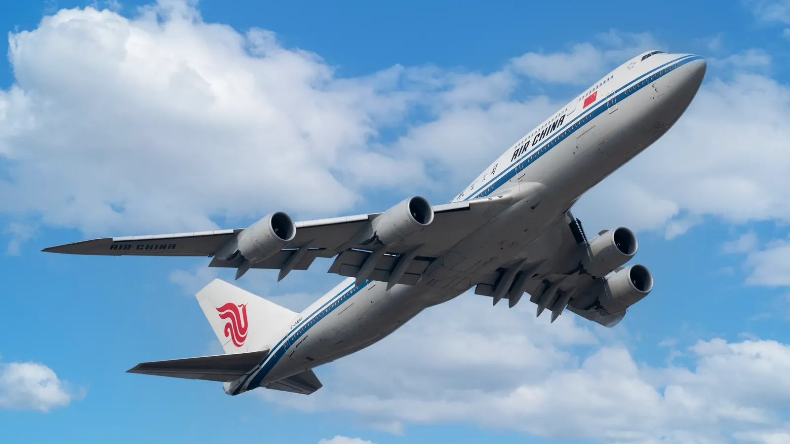

# 《空中浩劫：气象危机》期末作业
### By RichardYi

### Q1：这门课是公选课使用弹幕投屏，雨课堂问答互动的方式促进教学，你认为这种方式是否有助于你的课堂学习？是否有可改进之处？
我认为这种方式显然是有助于我们的课堂学习的。

首先，弹幕这种互动形式不同于传统的评论区，其具有实时性。可以说，弹幕将人们评论的对象从一个单独的视频或课程变为一个特定的瞬间。如视频中某一帧刷屏的彩色弹幕，或是这门课程中机长做出某个动作时的即时弹幕：如博南拉杆。

其次就是弹幕的信息补充效果。在这门课中，常常会出现飞友在视频开头便猜出这期的主题飞机或航班并打在公屏上，在老师提到特定航空知识点时也会有同学用弹幕发出与其相关的梗或知识。显然这种方式会使整个课堂的同学们都能够了解到不止于空难本身的更多知识，形成信息补充的效果。

可以说弹幕这一功能一举多得：于飞友而言，通过弹幕展现自己的相关知识能够获得成就感，而对其他的同学也能通过弹幕获得一些之前未了解过的有趣知识。

而雨课堂回答互动的教学形式，其优点就很明显了：提升同学们的课堂专注程度，同时也能通过回答正确来形成正反馈。

至于改进之处，我主要总结为以下几点：

1. 对发弹幕设置一个奖励机制：我注意到在课程的前期，同学们发弹幕都比较活跃，弹幕数量也较多。但是到了中后期，发弹幕的同学就变少了，只有零星几个。如果弹幕都没人发，其优势也无法体现了。因此对发弹幕的同学，可以设立一个奖励机制，比如发送一条具有意义的弹幕就加一点平时分，以此来提升同学们发弹幕的积极性。
2. 在课件开头提出几个与本节课气象知识相关的问题，以激发同学们的学习兴趣，能够让同学们知道学习了这节课后能解决怎样的问题。

### Q2：这门课介绍了许多航空气象案例，请结合你最感兴趣的一个案例，1）分析它所体现的跨学科知识；2）阐述跨学科学习带给你本科阶段学习和日常生活的启发和意义

**案例：**  特内里费空难

**空难全过程：** 当天，西班牙加那利群岛的大机场拉斯帕尔马斯机场遭遇恐怖炸弹威胁，航班被临时转移至附近的一个小机场——洛斯罗迪奥斯机场（特内里费机场）而机场规模较小，停机坪拥挤造成巨大交通指挥压力。

下午，机场突遭浓雾覆盖，能见度急剧下降至数百米，塔台无法直视跑道，完全依赖无线电通信。而跑道没有地面雷达系统，导致飞机位置只能靠语言交流判断。

KLM和PanAm的747都被指示到跑道尽头准备起飞，但没有专用滑行道。PanAm飞机未及时驶出跑道，在浓雾中找不到出口。而KLM飞机在准备起飞，误以为已经得到塔台“起飞许可”（实际上只是在“准备起飞”）。飞行员说：“我们正在起飞”时，塔台尝试紧急制止，但无线电被双方同时发言造成串频，部分信息未被接收。

最终KLM的飞机于浓雾中高速起飞时，撞上了仍在跑道上的PanAm飞机，**最终死亡人数达583人，成为航空史上最严重的空难**

**原因分析：**

| 因素        | 描述                                    |
| ----------- | --------------------------------------- |
| 🌫️ 天气      | 浓雾导致能见度低，视觉失效。            |
| 🗣️ **（主要原因）语言沟通**  | **使用模糊术语、误解指令、无线电串音。**    |
| 👨‍✈️ 人为错误 | KLM机长误解许可、过度自信、未再次确认。 |
| 🧭 管制失误  | 塔台调度混乱、缺乏地面雷达支持。        |

**跨学科知识：**

| 学科                  | 具体体现                                                     |
| --------------------- | ------------------------------------------------------------ |
| **气象学**            | 特内里费当天突然出现浓雾，导致能见度极差，影响飞行员视线与塔台判断。 |
| **航空工程**          | 跑道设计（仅为单跑道，且C3出口转弯困难）、滑行路线规划、无线电导航技术及视距起飞程序，涉及航空系统设计知识。 |
| **语言学**   | 飞行员与塔台之间使用非标准英语（荷兰口音）表达（例如“我们正在起飞”被误听为“我们在起飞点”），体现了语言在极端环境下的模糊性与误解风险。 |
| **心理学** | KLM 机长为资深教官，过度自信、时间压力大、等级制度使副驾驶难以纠正指令，体现了心理与组织结构对安全的影响。 |
| **管理学** | 飞机因另一起恐怖袭击被临时调流至小机场，机场调度应对突发事件能力不足，是事故形成链条的早期节点。 |

**跨学科学习的启发与生活意义：**

一、本科阶段学习的启发

1. 可以拓宽知识的视野，打破学科壁垒
   跨学科学习让我意识到，现实中的复杂问题往往无法用单一学科来解释。例如，在特内里费空难中，理解事故原因不仅需要气象知识，还涉及管理学、心理学、航空工程等相关的学科知识。这让我在面对课程学习时，更加注重“系统思维”，能够从多个角度深入分析问题，而不是停留在单一学科知识点上。

2. 提升综合分析与解决问题的能力
   在做案例分析或团队项目时，我学会了整合多门课程中学到的知识。例如，在分析航空事故中风切变对飞机性能的影响时，不仅需要运用了流体力学的知识，还需要结合心理学中的飞行员决策模型。又如高等数学中函数与导函数的关系与物理学中速度与加速度的关系紧密联系。这种跨领域的思维方式，使我在面对复杂任务时更加从容、有逻辑地处理问题。

3. 增强学习动力与主动性
   当我意识到某个领域的知识可以应用到另一个完全不同的领域时，我的学习兴趣明显提升。例如，物理知识不仅能解释飞行原理，还能帮助我理解天气雷达的工作机制；语言表达不仅仅服务于写作考试，也直接关系到工程指令、空管沟通的安全性。学习因此变得更“有用”、更“有意义”。

二、日常生活中的意义

1. 提升风险意识与安全素养
   通过跨学科学习，我对天气预报、航空延误等日常现象有了更科学的理解。例如，当我看到“低空风切变”、“雷暴警告”等术语时，不再只是简单抱怨航班晚点，而是能够理性地理解航空公司与飞行员的安全决策。又比如学会了通过观察云图等天气信息来预测延误概率以购买延误险来薅航司羊毛。
2. 加强沟通能力与协作意识
   很多事故的根源在于“沟通失败”——这让我意识到日常生活和学习中，表达清晰、团队协作同样关键。无论是在课程项目合作还是社团活动中，我都更加主动地倾听他人意见，并清晰表达自己的观点，避免信息误解。
3. 培养批判性与全局思维
   在日常信息接收中，我不再轻信单一视角，而是尝试从多个维度去思考问题。例如对一则新闻报道，我会考虑是否涉及科学、政治、心理等因素，从而做出更全面的判断。

### Q3：你认为这门公选课带给你最大的收获是什么？（可从学习或生活的角度思考）

首先，通过这门课的学习，我逐渐对民航客机产生兴趣，也渐渐地成为一名半入门的飞友。“拍飞机”成了周末的娱乐活动之一：在广州白云新建的西跑滑行道机位（可以从正面拍摄机场南向运行时滑行过来的飞机）用200-500mm长焦镜头拍摄国航747的正面照，也曾在土堆上待一个下午来拍南航的首架彩绘C919。在与同好们交流的过程中学习相关的飞行知识，也逐渐熟悉了各个客机的型号，期待着“好货”的降临。

记忆犹新的是一个周末为了拍飞机辗转于广深港三地：在香港观景山上拍到了壕航的A380以及多架747货机，还碰巧遇到了换向（由于风向改变导致起降方向改变）而得以拍全起降的全部视角。在深圳宝安的杜鹃谷爬了近半小时来到山顶的凤鸣亭机位，能够以长焦来远眺宝安机场（虽然当天气象报文为9999，但雾还是太大，因此没出几张片）。第二天回到广州，听到朋友说有747会落西跑，便马不停蹄地来到CAN，结果便是其起飞和滑行的瞬间都拍到了，成就感满满。

当然，除了拍飞机，我也受这门课的影响在b站上开始关注一些航空类、交通类博主，如机坪夜话、藻虾AmanoShrimp、本签派啊等。他们的视频有的讲解一款机型的前世今生，有的讲解一次航班的成本及盈利…使我对民航产业的整体面貌有了一个更加深入的认识。

除此之外，课程中的主角空中浩劫这部纪录片中也不乏许多英雄机组，如川航8633机组、执行海湾战争中被湍流吹掉两个发动机的美军KC130加油机机组等。在面对危机时能够沉着冷静地应对，竭尽所能以挽救整架飞机的乘客的性命，在也许仅有几秒的反应时间中随机应变，不顾自我安危或是舍己为人，只为飞机安全着陆的那个瞬间。我想空中浩劫这部纪录片所记录的不仅仅是空难本身，更是无数民航人为了更安全的飞行的呕心沥血，以及无数机组于万米高空与死神搏斗的悲壮篇章。

综上所述，我在这门课中所获得不仅仅是航空知识，也产生了对于航空摄影的兴趣。从纪录片中，我也从许多机长的身上学到了面对困难时无畏、沉着、奋战到底的勇气与决心。

*（附一张自己在白云机场拍的国航747-8 编号B-2480）*

祝老师的公选课越办越好！
